# AI-Assisted Development & Collaboration

This project was developed through an autonomous collaborative workflow between a human Software Engineer and the Gemini 3.5 Flash coding assistant.

---

## 1. Division of Labor

```mermaid
gantt
    title Development Division of Labor
    dateFormat  X
    axisFormat %d
    section Human Ownership
    System Architecture & Core Rules   :active, 0, 10
    Technical Constraints Selection    :active, 0, 10
    Code Review & Architectural Decisions:active, 0, 10
    Final Verification & Debug Validation :active, 0, 10
    section AI Acceleration
    Code Scaffolding & File Creation  : 2, 8
    Unit & E2E Test Suite Write       : 4, 9
    Docker & Compose Configuration     : 5, 9
    CI Action Workflows Writing        : 6, 9
```

### Human Ownership
- **Architecture Design**: Defined the monorepo structure, division of responsibilities, and routing strategy.
- **Constraints Definition**: Dictated the use of framework-free, ES5-compatible, prototype-based JavaScript for the SDK runtime, avoiding modern compiler bloat.
- **Critical Verification**: Reviewed test reports, identified configuration race conditions, and validated execution logs.

### AI Acceleration
- **Autonomous Scaffolding**: Generated the boilerplate, workspaces setup, and package configs.
- **Code Implementation**: Translated the prototype specifications into functional JavaScript code modules (FocusManager, TelemetryClient, AdBreakManager).
- **Test Generation**: Wrote the unit tests in Mocha, API route tests, and browser E2E navigation scenarios in Playwright.
- **Infrastructure & Docs**: Authored the Dockerfiles, Docker Compose config, Nginx proxies, and markdown documentation files.

---

## 2. Collaborative Problem Solving

During the execution phase, several technical errors were identified and resolved through joint debugging cycles:

1. **Topological Build Dependency**:
   - *Problem*: The static TV Demo workspace was compiling before the TV SDK finished bundling, leading to copy errors.
   - *Resolution*: Enforced explicit sequential build operations (`workspace=packages/tv-sdk` first) within the root `package.json` build script, and declared `@cross-tv-sdk/core` as a project workspace dependency.
2. **Mocha TypeScript Type Mismatch**:
   - *Problem*: ts-node compiled tests threw errors due to missing global types (`describe`, `it`).
   - *Resolution*: Installed `@types/mocha` into the API devDependencies and transitioned the compilation target from `NodeNext` to standard CommonJS to bypass import resolution bugs.
3. **Playwright WebServer Path Resolving**:
   - *Problem*: Playwright launched workspace execution commands inside the wrong relative directory scope.
   - *Resolution*: Updated command routing lines inside `playwright.config.js` to execute the Node API binary directly using relative file paths (`node ../api/dist/index.js`).
4. **Rollup UMD Global Binding**:
   - *Problem*: Playwright threw `TypeError: CrossTVSDK.DeviceProfile is not a constructor` because Rollup nested UMD exports under `.default`.
   - *Resolution*: Configured `exports: 'default'` in the Rollup bundler file to bind the CommonJS module directly to `window.CrossTVSDK`.
